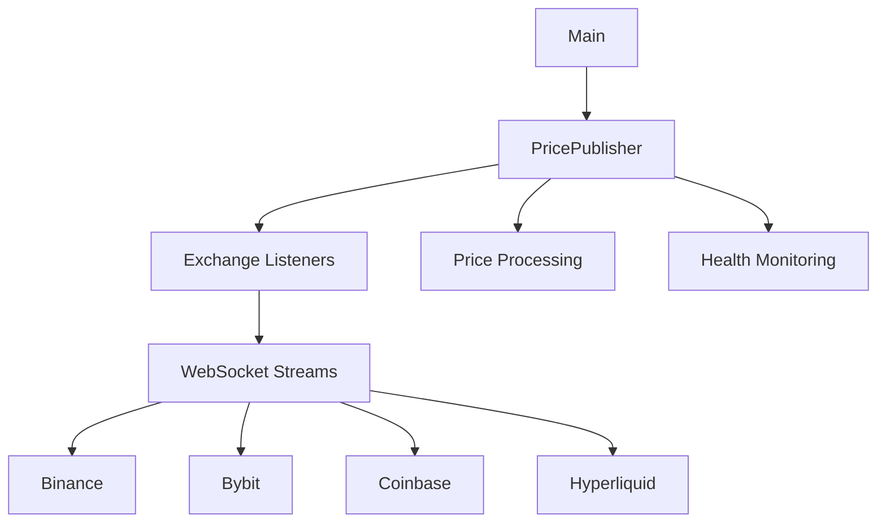

# Price Publisher

A standalone service that maintains WebSocket connections to various cryptocurrency exchanges, processes price updates, and manages the health of these connections.

## Architecture Overview



## Components

### 1. Main (`src/main.rs`)
- Entry point for the application
- Initializes logging (both file and stdout)
- Creates and runs the PricePublisher instance
- Sets up signal handling (ctrl+c)

### 2. Publisher (`src/publisher.rs`)
The core orchestrator that:
- Manages exchange connections
- Processes price updates
- Maintains health metrics
- Uses tokio channels for thread communication

Key components:
```rust
pub struct PricePublisher {
    exchanges: Vec<Arc<ExchangeImpl>>,
    health_metrics: Arc<RwLock<HashMap<String, ExchangeHealth>>>,
    latest_prices: Arc<RwLock<HashMap<String, HashMap<String, (f64, SystemTime)>>>>,
}
```

### 3. Exchange Trait (`src/exchanges/mod.rs`)
Defines the interface that all exchange implementations must follow:
```rust
pub trait Exchange: Send + Sync + Clone {
    fn init(&self) -> Result<()>;
    async fn listen(&self, price_sender: mpsc::Sender<PriceUpdate>) -> Result<()>;
    fn get_trading_pairs(&self) -> Vec<TradingPair>;
    fn get_name(&self) -> &str;
    fn is_healthy(&self) -> bool;
}
```

### 4. WebSocket Stream (`src/exchanges/ws_stream.rs`)
A reusable WebSocket client wrapper that handles:
- Connection establishment
- Message sending/receiving
- Automatic ping/pong
- Connection timeouts
- Error handling

## Thread Model

The application uses tokio's async runtime with multiple concurrent tasks:

1. **Main Thread**
   - Runs the main event loop
   - Handles shutdown signals
   - Manages task spawning

2. **Exchange Listener Tasks** (one per exchange)
   ```rust
   tokio::spawn(async move {
       loop {
           match exchange.listen(price_sender.clone()).await {
               Ok(_) => { /* Update health metrics */ }
               Err(e) => { /* Handle error */ }
           }
           tokio::time::sleep(Duration::from_secs(5)).await;
       }
   });
   ```
   - Each exchange runs in its own task
   - Maintains WebSocket connection
   - Sends price updates through channel
   - Auto-reconnects on failure

3. **Price Processing Task**
   ```rust
   while let Some(update) = price_receiver.recv().await {
       // Process price updates
       // Update latest prices
       // Log updates
   }
   ```
   - Receives updates from all exchanges
   - Updates the shared price state
   - Logs price information

## Data Flow

1. **Price Updates**
   ```
   Exchange WebSocket → WsStream → Exchange Implementation → 
   Channel Sender → Channel Receiver → Price Processing
   ```

2. **Health Metrics**
   - Each exchange maintains an atomic timestamp (`AtomicI64`) for its last heartbeat
   - Connection status and error counts are tracked in `health_metrics`
   - Metrics are protected by `RwLock` for thread-safe access

## Connection Management

### WebSocket Connections
Each exchange's WebSocket connection is managed by the `WsStream` struct:
```rust
pub struct WsStream {
    stream: WebSocketStream<MaybeTlsStream<TcpStream>>,
}
```

### Reconnection Logic
1. If a WebSocket connection fails:
   - The error is logged
   - Health metrics are updated
   - The task sleeps for 5 seconds
   - Connection is retried

### Health Monitoring
- **Connection Status**: Tracked in `ExchangeHealth.is_connected`
- **Error Count**: Incremented on failures in `ExchangeHealth.error_count`
- **Last Update**: Atomic timestamp in each exchange implementation
- **Heartbeats**: Updated on successful message processing

## Debugging Guide

### 1. Connection Issues
- Check logs for "Starting {exchange} price feed" messages
- Look for WebSocket connection errors
- Verify exchange endpoints are accessible
- Check error counts in health metrics

### 2. Price Updates
- Monitor "Received price update" log messages
- Check latest_prices map for specific symbols
- Verify exchange heartbeat timestamps

### 3. Common Issues
- **No Price Updates**: Check exchange connection status and error logs
- **Stale Prices**: Monitor heartbeat timestamps and connection status
- **High Error Count**: Review logs for specific exchange errors

### 4. Useful Log Patterns
```
[INFO] Starting {exchange} price feed          // Connection attempt
[ERROR] {exchange} price feed error: {error}   // Connection failure
[INFO] Received price update from {exchange}   // Successful update
```

## Configuration

Trading pairs are configured in `main.rs`:
```rust
let symbols = vec![
    "BTC/USD".to_string(),
    "ETH/USD".to_string(),
    // ...
];
```

Each exchange implementation handles symbol format conversion internally. 